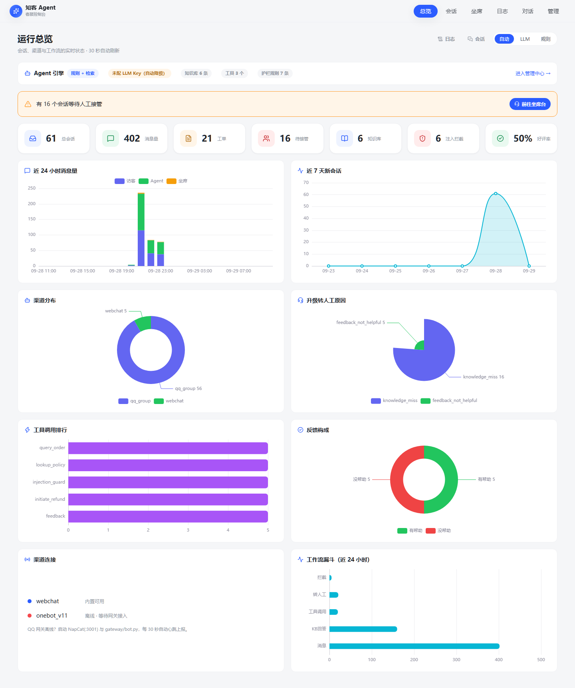
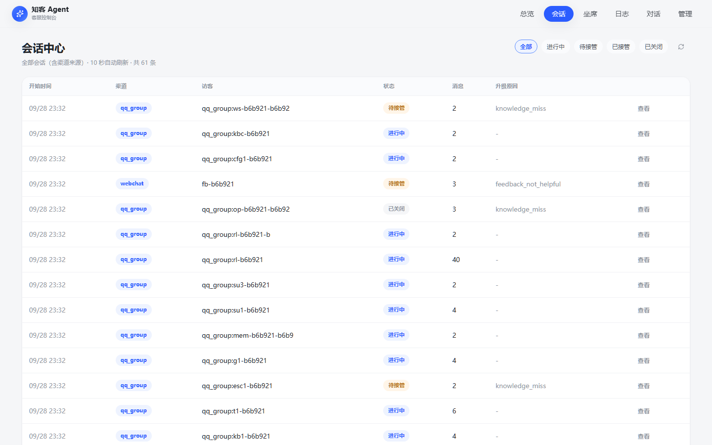
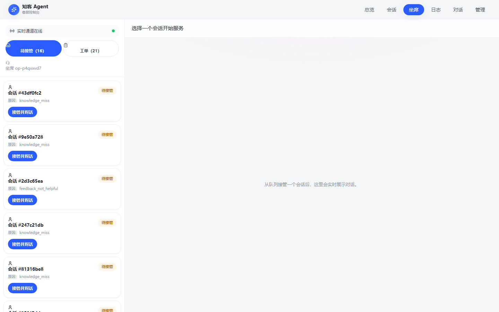
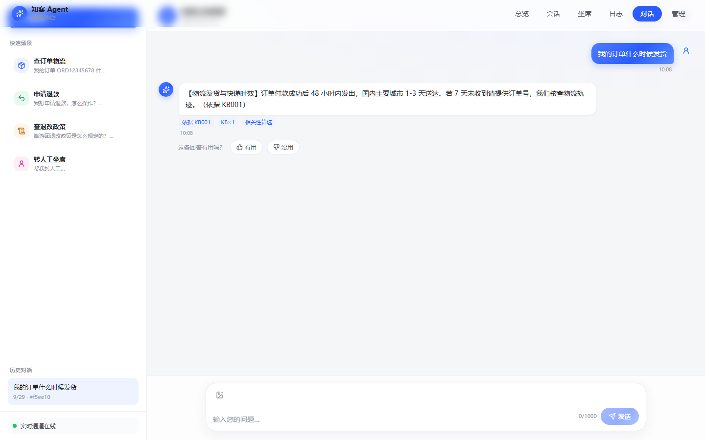
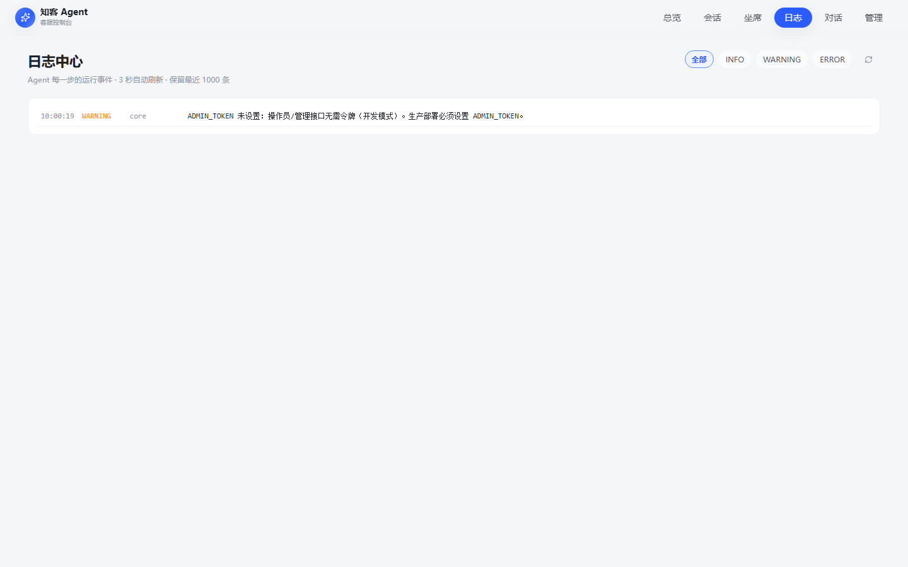

# 知客 Zhike · 在线客服 Agent（QQ 群 / 微信 / 控制台）

重做自 `badhope/online-cs-agent`（MIT）：把「Web 演示」升级为「渠道可接、可部署、可审计」的客服 Agent 底座。QQ 群走 NapCat(OneBot v11) + NoneBot2 网关，核心服务独立成 API，旧 React 坐席工作台原样复用。MIT 开源。

架构与完整决策见 [docs/UPGRADE_PLAN.md](docs/UPGRADE_PLAN.md)。

## 架构

```
QQ群/私聊 ─► NapCat ──OneBot v11──► NoneBot2 网关 ──┐
                                                    ├─► core (FastAPI)：护栏→检索→工具→LLM
Web 访客 + 坐席工作台 ──/api + /ws──────────────────┘     会话/记忆/工单/限流
```

## 截图与演示

| 运行总览 | 会话中心 |
|---|---|
|  |  |

| 坐席工作台 | 访客对话 |
|---|---|
|  |  |



完整演示视频（总览 → 会话 → 日志 → 真实提问 → 坐席台）：[docs/media/demo.webm](docs/media/demo.webm)
更多截图（含移动端与管理中心）见 [docs/screenshots](docs/screenshots)。

## 快速开始

```bash
# 1. 核心服务（无 LLM Key 自动进规则+检索模式，仍可用）
python -m venv .venv
.venv/Scripts/pip install -r requirements.txt      # Linux/macOS: .venv/bin/pip
cp .env.example .env                                # 按需填 USER_LLM_* / ADMIN_TOKEN

# 2a. 单端口模式（推荐）：构建前端后由 core 直接托管
cd frontend && npm install && npm run build && cd ..
CS_AGENT_STATIC_DIR=frontend/dist python -m uvicorn core.main:app --port 8010
# → http://localhost:8010 一个地址 = 控制台 + API

# 2b. 开发模式（前端热更新，二选一）：另开终端
cd frontend && npm run dev                           # http://localhost:5173（/api 自动代理到 core）

# 3. QQ 群接入（本机）
#    a) 启动 NapCat 并在 WebUI(:6099) 里把机器人 QQ 登录，开 WebSocket 服务 :3001
#    b) 网关连 NapCat 与 core
set ONEBOT_WS_URL=ws://127.0.0.1:3001
set CORE_BASE_URL=http://127.0.0.1:8000
.venv/Scripts/python gateway/bot.py
#    群里 @机器人 说「订单什么时候发货」即可
```

Docker 一键（NapCat + core + gateway）：见 `deploy/docker-compose.yml`。

## 配置（环境变量）

| 变量 | 说明 | 默认 |
|---|---|---|
| `USER_LLM_API_KEY/BASE_URL/MODEL` | OpenAI 兼容端点（DeepSeek/GLM/Qwen 均可）；不配则规则模式 | 空/DeepSeek |
| `ADMIN_TOKEN` | 操作员与管理接口令牌；**生产必须设置** | 空（开发模式，启动告警） |
| `RATE_LIMIT_WINDOW / RATE_LIMIT_MAX` | 每身份滑动窗口限流（秒/条） | 60 / 20 |
| `SESSION_IDLE_TTL` | 渠道会话空闲多少秒后新建 | 1800 |
| `CS_AGENT_DB` | SQLite 路径 | cs_agent.db |
| `CS_AGENT_STATIC_DIR` | 单端口模式：前端 dist 目录（空=纯 API） | 空 |
| `CS_AGENT_CORS_ORIGINS` | CORS 白名单（逗号分隔；空=*） | 空 |
| `ONEBOT_WS_URL` | NapCat 的 OneBot v11 WS 地址 | ws://127.0.0.1:3001 |
| `CORE_BASE_URL` | 网关回源核心服务地址 | http://127.0.0.1:8000 |

LLM 配好后可用 `POST /api/admin/llm-test`（管理页）实测连通性与延迟。

运行时还可以在坐席工作台「设置」里改 persona / 检索 top-K / 门槛 / 工具开关 / 注入规则（存 DB，即时生效）。

## 控制台页面（frontend :5173）

| 页面 | 地址 | 能做什么 |
|---|---|---|
| 运行总览 | /dashboard | 8 张统计卡 + 8 张 ECharts 图（消息量/会话趋势/渠道分布/升级原因/工具排行/反馈/工作流漏斗/渠道心跳），引擎模式一键切换 |
| 会话中心 | /sessions | 全部会话列表（渠道来源/状态筛选/消息数），点开看完整对话回放，可关闭会话 |
| 坐席工作台 | /operator | 待接管队列 + 工单，接管/回复/关闭（WebSocket 实时） |
| 日志中心 | /logs | Agent 运行事件实时滚动（3 秒刷新，级别过滤，保留 1000 条） |
| 访客对话 | / | 网页访客测试入口 |
| 管理中心 | /settings | 能力参数/工具注册表/注入规则/知识库/数据/记忆/注入日志 七大面板 |

## API

- `POST /v1/ingest`：渠道摄取（网关用）。body: `channel_type, channel_user_id, group_id?, text, display_name?` → `reply{text, citations, escalate, mode, tool_used}, session_id, ticket_id`
- `POST /v1/gateway/heartbeat`：网关心跳上报（30 秒一次，>90 秒无心跳显示 stale）
- 管理端：`GET /api/admin/{overview,stats,sessions,channels,logs,memory,injection-log}`（设 ADMIN_TOKEN 后需 X-Admin-Token）
- 旧版 Web API 全兼容（`/api/sessions`、`/api/operator/*`、`/api/config`、`/api/kb`、`/api/tools`、WS `/ws/{sid}`、`/ws/operator`）。

## 测试与验证

```bash
python -m pytest tests -q                    # 43 用例：管线/摄取/安全/网关映射/存储/前端兼容/统计/控制台
python scripts/e2e_check.py http://127.0.0.1:8010   # 18 项在线能力体检（对运行中的服务）
CORE_BASE_URL=http://127.0.0.1:8010 python scripts/fake_napcat.py  # QQ 全链路（伪装 NapCat，含心跳）
```

## 风险与合规（必读）

- NapCat 为**自定义非商用许可**的非官方协议端：个人/内部使用可接受，商用前必须复核其 LICENSE 原文并评估腾讯风控；合规优先场景改走 QQ 官方机器人 API（Roadmap P2）。
- 微信侧不做个人号协议；走企业微信「微信客服」/公众号客服接口（官方 API）。
- LLM Key 仅从环境变量读取，不落库、不进日志。
